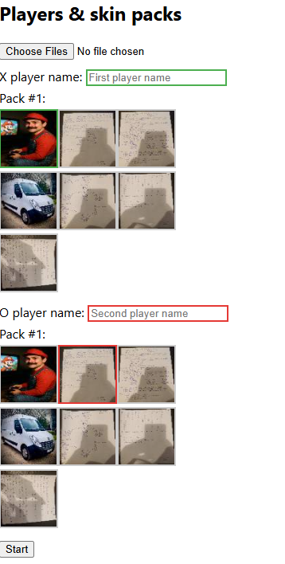

# PixelTac‑Toe

PixelTac‑Toe is a skin‑enabled **Tic‑Tac‑Toe** game written in F# with the WebSharper framework.  
It currently runs entirely in the browser, but a lightweight F# server is on the roadmap so players will be able to compete over the internet.

---

## ✨Features

| Area | Details |
|------|---------|
| **Two‑player mode** | Local play in one browser tab.  Each player can enter a custom display name. |
| **Skin packs** | Upload up to **9 images** at once; the game automatically generates 80×80px JPEG thumbnails and lets each player choose a unique icon. |
| **Dice‑roll starter** | At the beginning of a match, or after a draw, a dice roll decides who makes the first move. |
| **Scoreboard** | Persistent win counters for both players during the session. |
| **Localstorage** | Skin packs and the selected skins survive page reloads. |
| **Responsive UI** | Board is centred; images are scaled and have rounded corners. |
| **CI/CD** | GitHubActions build and publish the `/site` folder to **GitHubPages** – see <https://tonnkatonno.github.io/pixeltac-toe>. |

---

## 🚀Roadmap

| Milestone | Status |
|-----------|--------|
| Client‑side MVP | ✅Released |
| **Server‑side lobby & matchmaking** | ⏳Planned |
| Real‑time multiplayer via WebSockets | ⏳Planned |
| Mobile‑friendly layout | ⏳Planned |
| PWA / offline mode | ⏳Planned |

---

## 🛠️TechStack

- F#8 / .NET8  
- **WebSharperUI** for reactive views and SPA routing  
- **HTML5 Canvas** for client‑side image shrinking  
- **GitHub Actions** for CI/CD  
- **GitHubPages** for static hosting (until the server side ships)  

---


## 📦RunningLocally

```bash
# prerequisites
#   - .NET8 SDK   https://dotnet.microsoft.com/download
#   - Node.js18   https://nodejs.org/

# 1. restore & build
dotnet build

# 2. run the dev server
dotnet run
# → open http://localhost:5000


